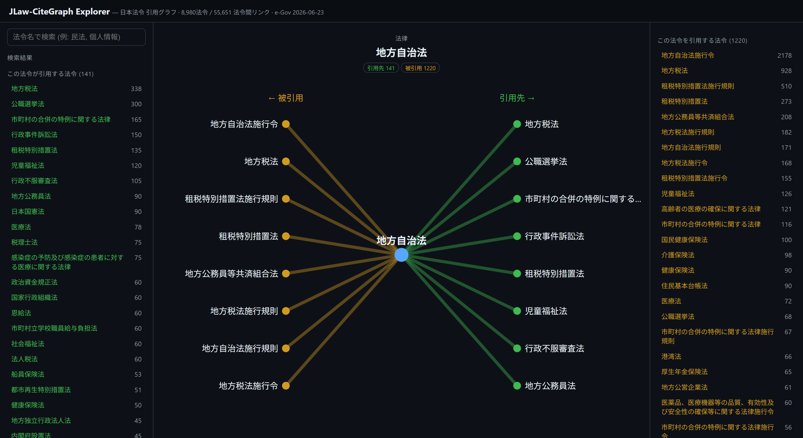

# JLaw-CiteGraph 🇯🇵⚖️

[English](README.md) · **日本語** · [한국어](README.ko.md)

  

**日本の法令間の引用関係を決定論的に解決した、オープンな引用グラフ。**

公式 [e-Gov](https://laws.e-gov.go.jp/) の法令XMLから決定論的に抽出し、すべてのエッジを特定の
法令・条に解決した再現可能な引用グラフです。精度は層化サンプルで検証しています（暫定 — 「制約」参照）。

[](explorer.html)

<sub>単一ファイルの **[`explorer.html`](explorer.html)** — 法令を選ぶと、その引用先（緑）と被引用元
（黄）が表示されます。表示中: 地方自治法（被引用が最多、1,220法令）。</sub>

> **同梱物:** グラフ（CSV/JSONL）· 単一ファイルのインタラクティブ **explorer**（`explorer.html`）·
> 再利用可能な決定論的Pythonリゾルバ（`jlawcite`）· そしてLLM（Claude等）がグラフを直接クエリできる
> **🔌 MCPサーバー** — [`mcp/`](mcp/README.md)。

| | |
|---|---|
| **法令（ノード）** | 8,980法令（e-Gov XML 10,229ファイル、2026-06-23スナップショット） |
| **解決済み外部エッジ** | **1,212,708**（条レベル）— うち **722,426が法令間**（法令A→法令B）+ 490,282が自己/版参照（附則内の新法/旧法）· **55,651の異なる法令間ペア** |
| **法令内エッジ** | 約3.6M抽出（本リリースは**法令間**グラフを同梱） |
| **エッジ精度** | *暫定値。* 経路層化サンプル400件で確認（現時点で確認された誤りなし）— ただし**ブラインド検証は未実施**のため、検証済みの精度ではなく目安としてお考えください。（[検証に協力 →](#貢献) · [手法](docs/METHODOLOGY.md)） |
| **外部解決率（recall）** | **生 68%** · 範囲内の実質引用で約85–90%*（小標本の推定）* |
| **手法** | 100%決定論的（正規表現+辞書+ルールベース解決）— *LLMなし・乱数なし・完全に再現可能かつ監査可能* |

> ⚠️ **最初にお読みください:** 本グラフは高精度の**下限（lower bound）**であり、*完全な*引用一覧ではありません。生のrecallは約68% — **エッジが無いことは「引用が無い」ことを意味しません。** 網羅的・権威的な情報源としては使わないでください（[正直な制約](#正直な制約)参照）。

> なぜ重要か: e-Govは法令の*本文*は提供しますが、解決済みの*引用ネットワーク*は提供しません。それを
> 作るには略称（`金商法`→`金融商品取引法`）、法令内照応（`旧法`/`新法`/`同法`）、over-grab、改名法令
> （`旧法令名`）を解決する必要があります。本リポジトリはそれを決定論的に行い、グラフを同梱します。

---

> **リリース = 日付付きスナップショット。** `v1` は **e-Gov 2026-06-23** スナップショット — 固定され、
> 引用可能で、再現可能な一時点（研究に適した形）。*最新*のグラフが必要なら `src/fetch_egov.py` で再生成
> でき、このリポジトリの更新に依存しません。

## 想定ユーザー
| あなたが… | 使い道 |
|---|---|
| **法律NLP研究者** | 条文検索/RAGを引用近傍で拡張、または `jlawcite` で自分のコーパスの引用を解決（例: COLIEE条文タスク） |
| **リーガルテック開発者** | 「Xを参照する法令は?」に回答 — 例: 個人情報保護法の改正で**110**の依存法令を洗い出し（検証済みの下限） |
| **比較法/ネットワーク研究者** | 法構造の研究: ハブ（地方自治法は1,220法令から被引用）、中心性、依存クラスタ（NetworkX/Neo4jへ） |
| **LLMリーガルアシスタント開発者** | 引用を決定論的に接地 — `会社法第737条`→特定の法令・条に解決、幻覚なし |
| **興味本位** | `explorer.html` を開き、日本の法令のつながりをクリックで探索 |

## 中身（`/data`）
- **`laws.csv`** — ノード: `law_id, name, type, url`
- **`cites_law_to_law.csv`** — 集約エッジ: `src_law_id, src_law, tgt_law_id, tgt_law, n_citations`（ネットワーク分析向け）
- **`cites_edges.jsonl.gz`** — 全エッジ: `src_law/src_article → tgt_law/tgt_article`、`via`（解決経路）+ `confidence` 付き

各エッジは `via` ∈ {`canonical`, `promulgation`, `alias`, `old_name`, `prefix_stripped`, `suffix`,
`local_def`, `local_def_tail`} と `confidence` を持つため、高信頼サブセットに絞り込めます。

## ひと目（グラフから計算）
**被引用が多い法令（ハブ）** — *他の*何法令から引用されているか:
| 法令 | 被引用 |
|---|---|
| 地方自治法 | 1,220 |
| 会社法 | 629 |
| 児童福祉法 | 500 |
| 行政手続法 | 462 |
| 民法 | 411 |

**影響分析** — 「Xを引用するのは?」→ 検証済みの下限: `個人情報保護法` ← **110法令**。

## 使う
```python
import pandas as pd
laws  = pd.read_csv("data/laws.csv")
edges = pd.read_csv("data/cites_law_to_law.csv")

# 被引用の多いハブ法令
hubs = edges.groupby(["tgt_law_id","tgt_law"])["src_law_id"].nunique() \
            .sort_values(ascending=False).head(20)

# 影響集合: ある法令を引用するのは?
target = laws[laws.name=="個人情報の保護に関する法律"].law_id.iloc[0]
print(edges[edges.tgt_law_id==target].src_law.tolist())
```
NetworkX / Neo4j に読み込んで中心性・コミュニティ検出、または **RAG基盤** として
（条文を検索→引用先/被引用元の条に展開）。

### LLMから使う — MCPサーバー（`mcp/`）
グラフ + 決定論的リゾルバを Model Context Protocol 経由で Claude/LLM に公開:
`resolve_citation`, `what_cites`, `what_law_cites`, `citation_path`, `get_law`。[`mcp/README.md`](mcp/README.md) 参照。

### 評価ハーネス（`eval/`）
精度/recall ラベリングサンプル + `compute_kappa.py` / `aggregate_precision.py`、および
[`eval/EVAL_PROTOCOL.md`](eval/EVAL_PROTOCOL.md) — *暫定*値（[docs/METHODOLOGY.md](docs/METHODOLOGY.md) 参照）を
ブラインド複数アノテータで検証済み測定値へ引き上げる方法。

## ゼロから再現
純Python標準ライブラリ — サードパーティ依存なし（Python 3.10+）。
```bash
cd src
python fetch_egov.py --out snapshot/                 # e-Gov法令スナップショットをダウンロード
python build_graph.py --corpus snapshot/ --out ../data/   # parse → extract → resolve → export
```
決定論的: 同じスナップショット + 同じコード → バイト単位で同一のグラフ。（既存のスナップショット
ディレクトリから再現するなら `build_graph.py` のみで十分。`fetch_egov.py` はコーパス更新用です。）

### コード（`src/jlawcite/`）— 単独でも再利用できる決定論的リゾルバ
```python
from jlawcite import citation, resolver, parser
refs, _ = citation.extract_external("会社法第七百三十七条第二項の…")   # -> ExtRef(law='会社法', art=737, …)
```
`parser`（e-Gov XML → 条/項/号）、`citation`（ルールベース抽出 + 法令内定義照応）、
`resolver`（`LawNameIndex`: 法令番号/正式名/旧法令名/略称/over-grabトリム解決）。

## 正直な制約
- **recallは完全ではない（生 約68%）。** 取りこぼしの大半は (a) 抽出アーティファクト/共参照、
  (b) **範囲外ターゲット** — 廃止/改名法令、条約、外国法（現行のみのコーパスに*ノードがない*）。
  検証済みエッジは正しく、グラフは高精度の**下限**であり、網羅的ではありません。
- **現行版のみ。** エッジの約22%は版依存の参照（`旧法`/`改正前`）で現行版に縮約されます。版レイヤなしでは
  改正伝播分析には不向きです。
- **国の法令のみ** — 条例や判例は含みません。
- 精度はサンプルラベリング（LLM提案 + 人手スポットチェック）で検証。より大きなブラインド複数
  アノテータラウンドは今後の課題です。

## 貢献
Issue・PR歓迎 — [CONTRIBUTING.md](CONTRIBUTING.md) 参照。上記の制約がそのままロードマップです。協力歓迎:
- **ブラインド注釈ラウンド** → 精度/recallを*暫定*から*検証済み*に（`eval/precision_sample.csv` / `eval/recall_gold_sample.csv` をラベリング。[eval/EVAL_PROTOCOL.md](eval/EVAL_PROTOCOL.md)）。
- **版対応レイヤ** → 約22%の版依存エッジを特定の版に解決（改正伝播分析が可能に）。
- **カバレッジ** → 条例/判例、標準略称辞書の拡張。
- **誤ったエッジ・取りこぼした引用を見つけたら?** *データIssue*を開いてください（テンプレートは `.github/`）。

## ライセンス
コード: Apache-2.0。データ/グラフ: CC-BY-4.0（出典: e-Gov 法令データ、公開）。`LICENSE`, `DATA_CARD.md` 参照。

## 引用
```
@misc{jlaw_citegraph_2026,
  title  = {JLaw-CiteGraph: An open citation graph of Japanese statutory law},
  year   = {2026},
  note   = {e-Gov 2026-06-23 snapshot},
  url    = {https://github.com/yabooung/jp-law-citation-graph}
}
```
